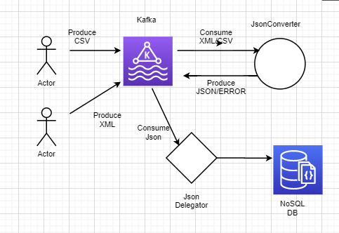
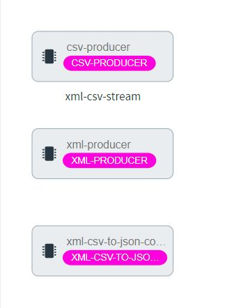
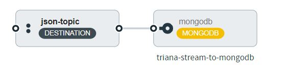

# ETL - Triana assignment  

There are two types of formats that need to be sent to a Kafka message bus , one that is CSV and one is XML.. and maybe in the future other formats, all needed to be transformed to JSON that will be sent back to Kafka.

Also There is another consumer/s that can store the transformed JSON that is stored onto an NOSQL database.

I used Spring dataflow & spring cloud streams to implement this.
I created dummy producers one that generates csv, one that generate an xml - every second,
They publish it to an output channel that get consumed by a xml-csv-converter processor.
The xml-csv-converter processor produce to json-topic after transforming the data.
That json-topic is delegating the JSONS to _mongodb sink_  application (out of the box application).

  

this could be replaced with Casandra sink application (out of the box application).

  
## Components  
  
 - xml producer - a dummy xml producer which generates every second a user in xml format to the output channel.  
 - csv producer - a dummy csv producer which generates every second a user in csv format to the output channel.  
 - converter-processor - a processor which takes the outputs from producers named *xml-topic,csv-topic* and transform the data to json on seperate channels & write it to a topic named *json-topic*. the errors are sent automatically to a DLQ.   
   
 ## Environment  
  use data-flow environment to quick start:  
  [https://github.com/aviadshiber/spring-dataflow-demo](https://github.com/aviadshiber/spring-dataflow-demo)  
    
 - Register the apps as *csv-producer,xml-producer,xml-csv-to-json-converter* accordingly.  
  
   
 ## Loading the stream  
  in the project there is a stream.json file that can be loaded to spring-data-flow (**this must be done after registering the apps**).  
 **Before deploying** - update the property of mongodb *uri* to your mongodb server.  
 replace user,password,host with your own  
  

     --uri=mongodb+srv://<user>:<password>@<host>/test?retryWrites=true&w=majority  

The stream file will configure  two streams:  
 1. xml-csv-stream  
 2. mongodb sink  
 
 and will plug them together.  
  
  
*that it!   just Deploy and enjoy!*